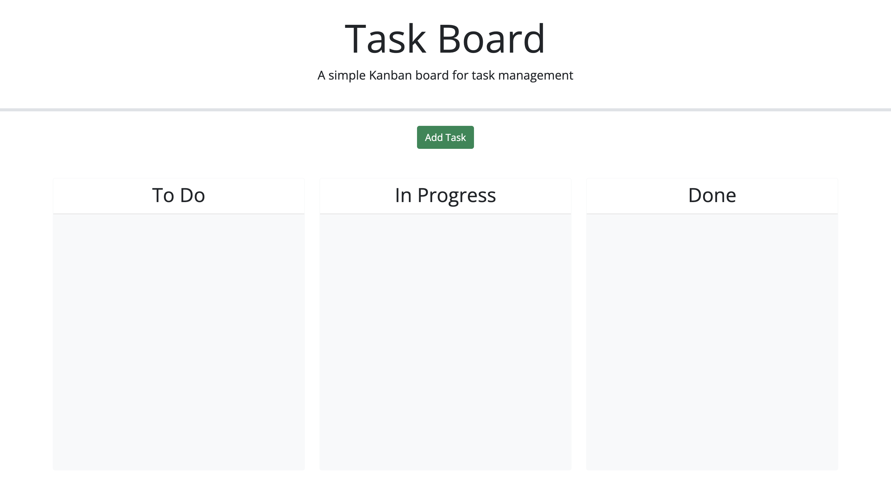

# challenge05-owen-kanzler

## Description

This is challenge 05 of the UMN Bootcamp. Here I completed the functionality of a simple Kanban board. I used Jquery, JqueryUI, DayJS, and Bootstrap. I manipluated the DOM to add different tasks that get saved into local storage for later use. The app shows depending on the date chosen a different background for the due date status. The user is able to move their tasks between columns where they will then be saved.

## Assets

## Usage

https://owenkanzler.github.io/challenge05-owen-kanzler/

## License

Please refer to the LICENSE in the repo.
